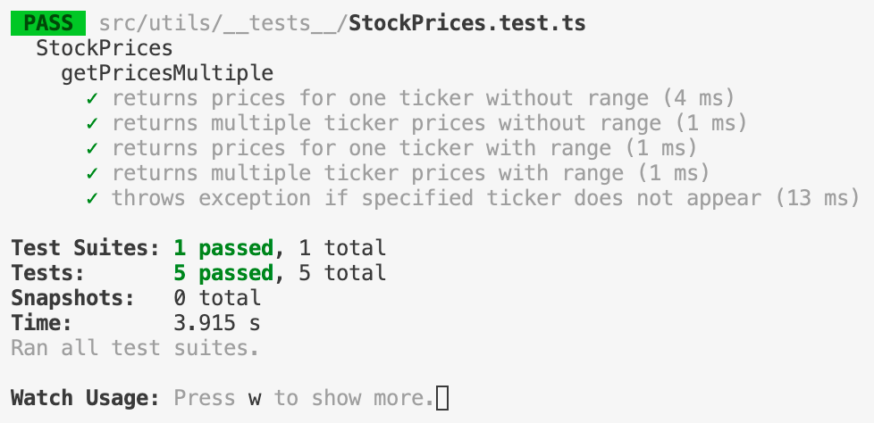
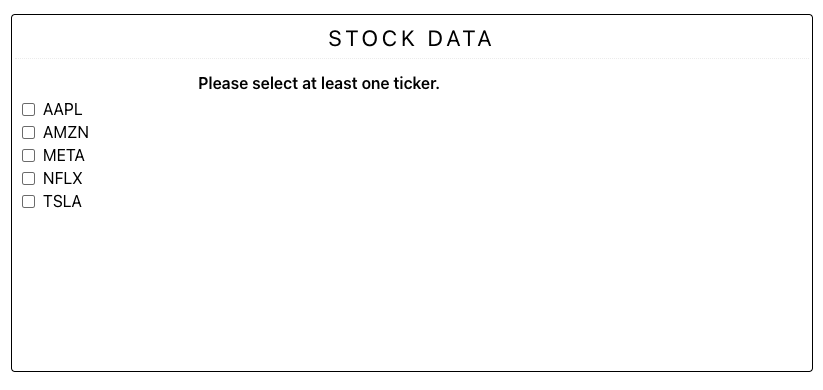
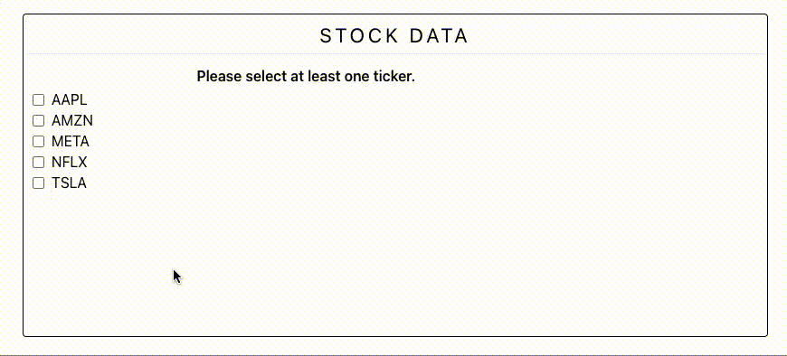

# Basic Stock Data Visualizing Component

## Overview

This sample project provides a React component (written in TypeScript) which, provided stock data, displays cells of stock prices by date.

This sample project also provides a utility class for searching stock data by dates and tickers.

## Project Structure

```
src/
|_ components/   (1)
|_ utils/        (2)
```

The most relevant files are:

* `src/components/StockPriceExplorerComponent.tsx`
* `src/utils/StockPrices.ts`

In `App.tsx`, you'll find the `StockPriceExplorerComponent` being used.

## How to Run

#### Install Dependencies

Install the necessary dependencies by running:

`npm install`

*Note:* This project was developed using `node v.16.15.1`, though earlier and later versions may work as well.

#### Run Tests

Run tests (for the util class) by running:

`npm test`

You should see the following, demonstrating that all use cases for the stock price utility class are passing:



#### Run the Webserver

Run the webserver by running:

`npm start`

You should be met with the following page in your browser. If your browser doesn't open automatically, you can find the app at `localhost:3000` by default.



By clicking on the various stock tickers, you should see the table update.


